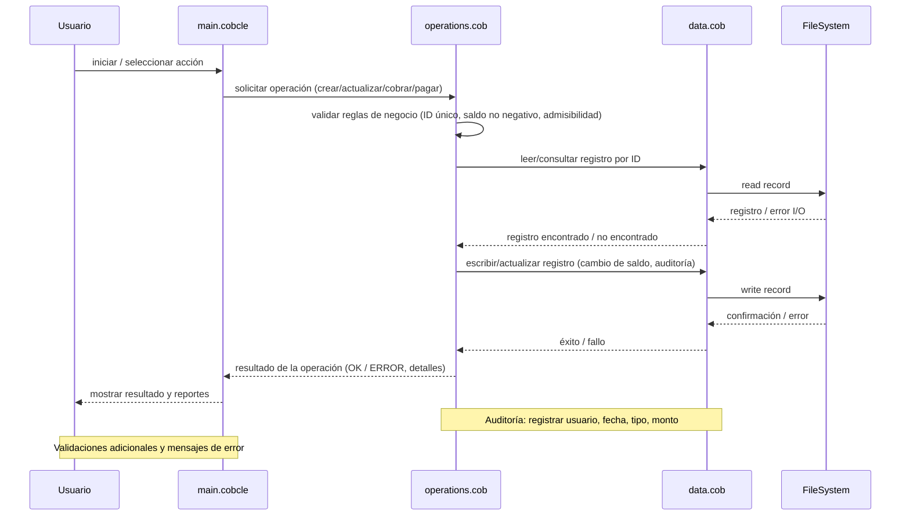

**Propósito del directorio**
- **docs/README.md**: Documentación de los archivos COBOL del proyecto, funciones clave y reglas de negocio relacionadas con las cuentas de estudiantes.

**Archivos COBOL**

- **main.cob**: Entrada principal del programa.
  - Función clave: Controla el flujo de la aplicación, inicializa recursos (archivos, buffers), muestra menús y despacha llamadas a las rutinas de `operations.cob` para procesar solicitudes.
  - Comportamiento esperado: Validación básica de parámetros de entrada, manejo de errores de I/O y cierre ordenado de archivos al terminar.

- **data.cob**: Gestión de datos y acceso a ficheros.
  - Función clave: Definición de estructuras de datos (registro de estudiante, cuentas), lectura y escritura en archivos secuenciales o indexados, y utilidades para buscar/recuperar registros por clave (por ejemplo, ID de estudiante).
  - Comportamiento esperado: Operaciones atómicas de carga/actualización de registros y manejo de formatos fijos de campo.

- **operations.cob**: Lógica de negocio y operaciones sobre cuentas de estudiantes.
  - Funciones clave: Crear cuenta, actualizar datos del estudiante, aplicar cargos (matrícula, cuotas), procesar pagos, calcular saldos, y generar reportes o listados.
  - Interacción: Llama a `data.cob` para persistir cambios y es invocada desde `main.cob` según acciones del usuario.

**Reglas de negocio específicas (cuentas de estudiantes)**

- **Identificador único**: Cada estudiante debe tener un ID único; las operaciones de búsqueda, actualización y pago usan este ID como clave primaria.
- **Saldo no negativo**: El sistema no debe permitir saldos negativos en la cuenta del estudiante. Cargos que superarían el límite deben ser rechazados o marcarse como pendientes según la política.
- **Aplicación de cargos**: Matrículas y cuotas se aplican como cargos en la cuenta y afectan inmediatamente el saldo. Cada cargo debe registrar fecha, tipo y referencias (por ejemplo, periodo académico).
- **Pagos**: Los pagos deben reducir el saldo disponible y registrar la fecha y forma de pago. Los pagos parciales son permitidos.
- **Estados de cuenta**: Definir al menos estos estados: `ACTIVA`, `INACTIVA`, `MORA`. Una cuenta pasa a `MORA` si existe saldo vencido por más de 90 días (configurable).
- **Reglas de admisibilidad**: No permitir inscripciones nuevas si la cuenta tiene deuda mayor a un umbral configurable. Validar créditos máximos por periodo si aplica.
- **Auditoría mínima**: Todas las operaciones que modifican saldo deben dejar rastro con: usuario/operador, fecha/hora, tipo de operación y monto.

**Notas de mantenimiento**

- Antes de cambiar formatos de registro en `data.cob`, actualizar cualquier rutina de lectura/escritura y migrar datos existentes.
- Separar validaciones (en `operations.cob`) de I/O (en `data.cob`) para facilitar pruebas y modernización.
- Documentar en comentarios los contratos de entrada/salida de las principales rutinas para acelerar la migración a servicios modernos.

Si desea, puedo:
- Añadir ejemplos de uso (flujos comunes) en este README.
- Extraer y documentar las rutinas concretas leyendo el código para reflejar nombres y firmas exactas.
 
**Diagrama de secuencia (Mermaid)**

